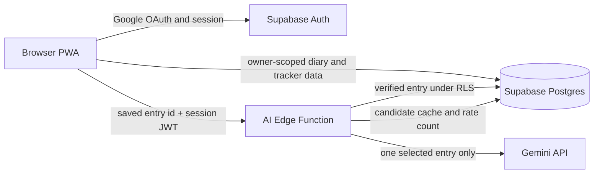

# Architecture

## Purpose

Life Journal is a personal diary and practice tracker. A diary entry is the
source record. Actions and habits are user-controlled plans that may be linked
back to the entry that prompted them.

## Runtime layout

The static React/Vite PWA runs on the public HTTPS site. The browser contains
only the Supabase URL and publishable key. Supabase Auth, Row Level Security
(RLS), and the user's JWT enforce access to personal data.

## Data model

| Area | Tables | Notes |
| --- | --- | --- |
| Journal | `journal_entries` | Multiple entries per local date; optimistic `version` check protects concurrent editing. |
| Actions | `action_items` | Optional due date, completion and archive states; may link to an entry. |
| Habits | `habits`, `habit_completions` | Weekly or monthly cadence, period start preference, and countable completions. |
| AI candidates | `ai_action_suggestions` | A cache keyed by user, entry, and entry version; users do not read it directly. |

All product tables have RLS enabled. The normal browser session can only access
rows whose `user_id` matches `auth.uid()`.

## AI suggestion flow

1. The user saves a diary entry and explicitly asks for suggestions.
2. The browser sends only that entry's ID and the current Supabase session JWT.
3. The Edge Function fetches the entry with the caller's RLS identity.
4. It returns a version-matched cache if one exists; otherwise it checks a
   per-user daily limit and sends the selected entry to Gemini.
5. Gemini returns at most three structured candidates. Each candidate must quote
   an exact substring from the entry, or it is dropped.
6. The browser shows editable candidates. Nothing becomes an action or habit
   until the user selects **Add to plan**.

The Edge Function has service-role access only for cache writes and rate-limit
queries. It does not use that access to read arbitrary diary content.

## Boundaries

- Personal infrastructure owns production data and secrets. Company accounts,
  projects, and credentials are outside this system.
- `GEMINI_API_KEY` lives only in Supabase Edge Function secrets. It is never
  bundled into the browser or committed to Git.
- The first AI feature uses a single selected entry. It does not need vector
  search. A future cross-entry review can start with date-range SQL queries;
  semantic retrieval should be introduced only when that limitation is observed.
- Email reminders, push notifications, chat, and MCP are product extensions,
  not implicit capabilities of the current app.
